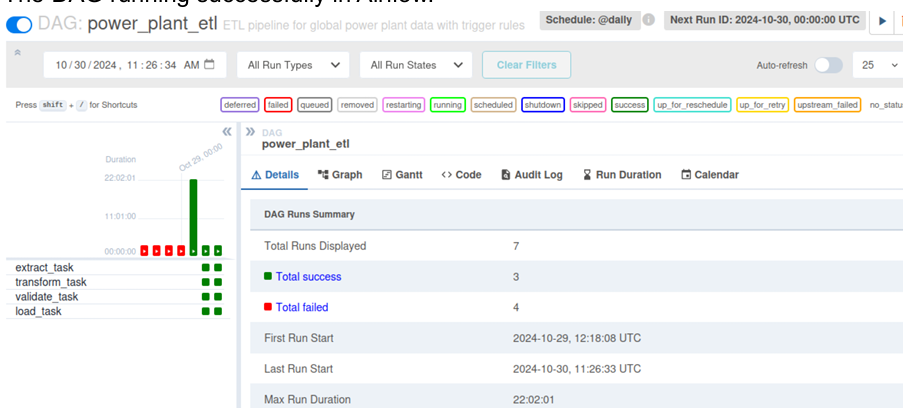
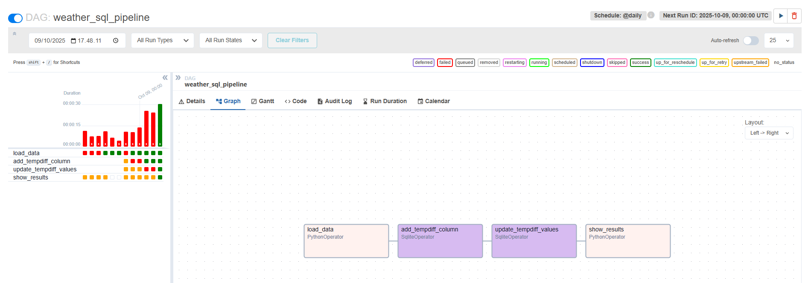

# 🌟 Airflow ETL Projects: Power Plant & Weather Data

  

This repository contains **two hands-on ETL pipelines using Apache Airflow**.  
They demonstrate **loading CSV datasets into SQLite**, performing **SQL transformations**, and automating **data workflows**.  
Ideal for building **portfolio projects** in **data analysis, AI, and data engineering**.

---

## 🗂️ Project Structure
Data-Engineerin-Projects/
airflow/
│
├── dags/
│ ├── power_plant_sql_pipeline.py # ETL pipeline for power plant data
│ └── weather_sql_pipeline.py # ETL pipeline for weather data
├── data/
│ ├── power_plant_testing.csv # Power plant dataset
│ ├── power_plant_training.csv # Power plant dataset
│ └── weatherHistory.csv # Weather dataset
└── README.md

---

## 1️⃣ Power Plant Data Pipeline

**DAG ID:** `power_plant_sql_pipeline`  
**Description:** Loads **CCPP dataset**, stores it in SQLite, and calculates **average power by temperature**.  

### 🚀 DAG Task Overview

| Task | Description |
|------|-------------|
| `create_table` | Create `power_plant_data` table if not exists |
| `load_data` | Load CSV into SQLite table |
| `calc_avg` | Create `avg_power` table (AVG PE by rounded AT) |
| `show_results` | Display sample results from `avg_power` |

### 📊 Sample Workflow Diagram


**Database:** `/tmp/powerplant.db`  
**Tables:** `power_plant_data`, `avg_power`  


---

## 2️⃣ Weather Data Pipeline

**DAG ID:** `weather_sql_pipeline`  
**Description:** Loads **historical weather dataset**, cleans column names, and adds **calculated columns**.  

### 🚀 DAG Task Overview

| Task | Description |
|------|-------------|
| `load_data` | Load and clean CSV data into SQLite |
| `add_tempdiff_column` | Add new column `TempDiff` |
| `update_tempdiff_values` | Compute `TempDiff = TemperatureCelsius - ApparentTemperatureCelsius` |
| `show_results` | Display sample rows |

### 📊 Sample Workflow Diagram


**Database:** `/tmp/weather.db`  
**Tables:** `weather`  

---

## ⚙️ Prerequisites

- Python 3.10+  
- Apache Airflow 2.9+  
- Pandas  
- SQLite (built-in)

**Install dependencies:**
```bash
pip install apache-airflow==2.9.3 pandas


